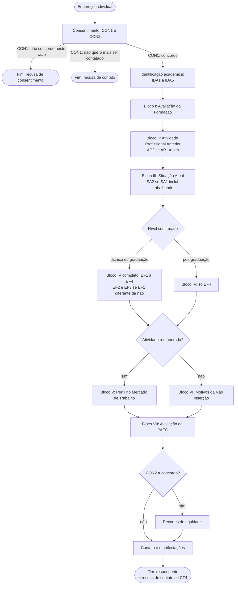

# Navegação condicional

**Etapa:** E14 — definir a lógica de navegação condicional
**Data:** 29/09/2026
**Decorre de:** [`blocos-instrumento.md`](blocos-instrumento.md) (E12 e E13), máquina de estados de [`parametros-contato.md`](parametros-contato.md) (E05, seção 12) e [`capacidades-plataforma.md`](capacidades-plataforma.md) (E08)

Especificação dos caminhos do instrumento: em que ordem os blocos aparecem, o que é
exibido a quem, como o preenchimento termina — e em que estado do participante cada
término o deixa —, e como o respondente se movimenta entre as páginas.

É insumo direto da E15 (implementação), da E20 (mensagens), da E21 (rotina), da E22
(consentimento), da E25 (matriz), da E26 (cenários) e da E28 (extração).

## 1. Objeto e método

**Objeto.** Os caminhos alternativos do instrumento de onze blocos definido nas
etapas E12 e E13.

**Método.** Consolidação. As regras de exibição já estavam decididas — o público de
cada bloco pela E12, a condição de cada campo pela E13 — e esta etapa as reúne numa
só tabela, acrescenta o que nenhuma das duas decidiu, enumera os caminhos e os
verifica por execução (seção 8). O que faltava: como o preenchimento termina e em
que estado deixa o participante; e como o respondente se movimenta — paginação,
voltar, retomar.

**O que esta etapa não faz.** Não implementa nada na plataforma, que é a E15. Não
redige o texto das telas, que é da E22 e do projeto correlato. Não trata do envio de
mensagens, que é da E20 e da E21.

**Decisões tomadas** (confirmadas com o orientando antes da execução):

1. **Um bloco por página**, com o consentimento sempre na primeira.
2. **Voltar é permitido**, com as regras recalculadas e o descarte do que sair do
   caminho (seção 7.2).
3. **A retomada é por "salvar e retomar", com nome e senha**, e não pela simples
   reabertura do endereço individual (seção 7.3).

## 2. Ordem e paginação

| Página | Bloco | Exibido quando |
|---|---|---|
| 1 | Consentimento | sempre |
| 2 | Identificação acadêmica | CON1 = concordo |
| 3 | Bloco I — Avaliação da Formação | CON1 = concordo |
| 4 | Bloco II — Atividade Profissional Anterior | CON1 = concordo |
| 5 | Bloco III — Situação Atual | CON1 = concordo |
| 6 | Bloco IV — Evolução na Formação | CON1 = concordo |
| 7 | Bloco V — Perfil do Egresso no Mercado de Trabalho **ou** Bloco VI — Motivos da Não Inserção | CON1 = concordo; V com atividade remunerada, VI sem |
| 8 | Bloco VII — Avaliação da PAEG | CON1 = concordo |
| 9 | Recortes de equidade | CON2 = concordo |
| 10 | Contato e manifestações | CON1 = concordo |

Quem recusa vê uma página. Quem preenche vê nove, ou dez com os recortes de equidade.

**Atividade remunerada** — a condição que separa os Blocos V e VI — tem a definição
da seção 12.3 de `blocos-instrumento.md`: SA1 é "trabalhando" ou "estudando e
trabalhando", **e** SA2 não é "estagiário não remunerado" nem "em negócio familiar
sem remuneração". A seção 3 a chama de **R**.

**Por que um bloco por página.** O bloco já é a unidade de finalidade e de público, e
a página é a unidade que a plataforma grava: a E08 verificou que a linha de resposta
só nasce quando uma página é enviada. Com o consentimento sozinho na primeira página,
"iniciado" passa a significar "passou pelo consentimento" — o que casa com a máquina
de estados da E05 (seção 4).

## 3. Regras de exibição

### 3.1 Blocos

| Bloco | Exibido quando |
|---|---|
| Consentimento | sempre |
| Identificação acadêmica, Blocos I, II, III, IV e VII, Contato e manifestações | CON1 = concordo |
| Bloco V | CON1 = concordo **e** R |
| Bloco VI | CON1 = concordo **e não** R |
| Recortes de equidade | CON1 = concordo **e** CON2 = concordo |

### 3.2 Campos

Dentro de um bloco exibido, todo campo é exibido, salvo os da tabela:

| Campo | Exibido quando | Depende de campo da mesma página? |
|---|---|---|
| CON2 | CON1 = concordo | sim |
| AP2 | AP1 = sim | sim |
| SA2 | SA1 = trabalhando **ou** estudando e trabalhando | sim |
| EF1 | IDA2 = técnico **ou** graduação | não — depende da página 2 |
| EF2, EF3 | IDA2 = técnico **ou** graduação, **e** EF1 = concluí **ou** estou matriculado | sim, para EF1 |

**A dependência na mesma página é dinâmica.** CON2, AP2, SA2, EF2 e EF3 aparecem ou
somem na própria página, conforme a resposta de que dependem, sem exigir envio. É
requisito para a E15.

**EF4 é exibido a todos** que chegam ao Bloco IV, inclusive à pós-graduação: as
demandas de formação não dependem do nível.

### 3.3 O valor confirmado decide

Toda regra que depende de atributo acadêmico usa o valor **enviado na página 2** —
confirmado ou corrigido —, e nunca o atributo pré-preenchido. Exemplo: o arquivo de
entrada diz técnico; o egresso corrige o curso para um de graduação, e com ele o nível
(IDA2 acompanha o curso); o Bloco IV passa a perguntar pela pós-graduação, e não pelo
superior.

## 4. Saídas e estados

| Saída | Como ocorre | Estado do participante (E05, seção 12) | Conta como respondente? |
|---|---|---|---|
| recusa de consentimento | CON1 = não concordo com o termo neste ciclo; página 1 enviada | `recusa de consentimento` | não |
| recusa de contato | CON1 = não quero mais ser contatado; página 1 enviada | `recusa de contato` | não |
| conclusão | CON1 = concordo; última página enviada | `respondente` | sim |
| conclusão com recusa de contato | conclusão com CT4 marcado | `respondente` neste ciclo; `recusa de contato` nos seguintes | sim |
| interrupção depois do consentimento | CON1 = concordo; questionário não enviado | `em preenchimento`; `expirado` ao fim da janela de 60 dias | não |
| abertura sem envio | endereço aberto, nenhuma página enviada | `convidado` — abrir não cria resposta (E08) | não |

**A regra que decide: o estado sai de CON1, e não da marca de "concluído" da
plataforma.** As duas recusas encerram o preenchimento na primeira página, e a
manifestação precisa ser gravada — data, hora, ciclo, versão do termo e via, como
a P6 exige. Conforme o modo como a plataforma encerrar, o registro pode sair marcado
como concluído. **Isso não o torna respondente.** Contado como respondente, quem
recusou entraria no denominador de todos os indicadores e pareceria ter respondido
a nada. Por isso:

- uma resposta com CON1 diferente de "concordo" é **registro de recusa**, qualquer
  que seja a marca da plataforma;
- os denominadores de "respondentes" da seção 12.4 de `blocos-instrumento.md`
  excluem as recusas;
- as recusas interrompem a cadência de lembretes, como a E05 determina.

## 5. Os caminhos

No nível dos blocos, o instrumento tem **dez caminhos**. Três respostas decidem o
caminho depois do consentimento: CON2, o nível confirmado e R.

| Caminho | CON1 | CON2 | Nível confirmado | R | Blocos exibidos |
|---|---|---|---|---|---|
| C1 | não concordo neste ciclo | — | — | — | Consentimento |
| C2 | não quero mais ser contatado | — | — | — | Consentimento |
| C3 | concordo | concordo | técnico ou graduação | sim | Consentimento, Identificação, I, II, III, IV completo, V, VII, Equidade, Contato |
| C4 | concordo | concordo | técnico ou graduação | não | Consentimento, Identificação, I, II, III, IV completo, VI, VII, Equidade, Contato |
| C5 | concordo | concordo | pós-graduação | sim | Consentimento, Identificação, I, II, III, IV só EF4, V, VII, Equidade, Contato |
| C6 | concordo | concordo | pós-graduação | não | Consentimento, Identificação, I, II, III, IV só EF4, VI, VII, Equidade, Contato |
| C7 | concordo | não concordo | técnico ou graduação | sim | Consentimento, Identificação, I, II, III, IV completo, V, VII, Contato |
| C8 | concordo | não concordo | técnico ou graduação | não | Consentimento, Identificação, I, II, III, IV completo, VI, VII, Contato |
| C9 | concordo | não concordo | pós-graduação | sim | Consentimento, Identificação, I, II, III, IV só EF4, V, VII, Contato |
| C10 | concordo | não concordo | pós-graduação | não | Consentimento, Identificação, I, II, III, IV só EF4, VI, VII, Contato |

"IV completo" é EF1 a EF4; "IV só EF4" é a parte de demandas. **Dentro de cada
caminho**, três variações de campo, independentes entre si: AP2 aparece se AP1 for
"sim"; SA2 aparece se SA1 incluir "trabalhando"; e, no IV completo, EF2 e EF3
aparecem se EF1 não for "não".

**R = não reúne quatro situações**, e todas seguem para o Bloco VI: só estudando; nem
trabalhando nem estudando; estagiário não remunerado; e em negócio familiar sem
remuneração. As duas últimas trabalham, mas sem remuneração — é a correção que a E13
fez sobre o instrumento documentado, em que "trabalhando" as incluía.

## 6. Diagrama de fluxo

O diagrama omite, para não se tornar ilegível, duas coisas que valem em qualquer
ponto depois do consentimento: a interrupção, que deixa o participante `em
preenchimento`, e o voltar, que recalcula o caminho (seção 7). O nó "Nível
confirmado" não é página: a divisão acontece dentro da página 6.

**Conferido por renderização:** o bloco acima, extraído deste arquivo sem
alteração, foi desenhado pela biblioteca Mermaid, versão 11, sem erro de sintaxe e
com os dezenove nós previstos.

## 7. Movimentação

### 7.1 Paginação

Um bloco por página, na ordem da seção 2. A plataforma grava a resposta a cada página
enviada, e é essa gravação que torna possível retomar sem perder o que já foi feito.

### 7.2 Voltar

**Permitido, com as regras recalculadas a cada página.** Se o respondente volta e
muda uma resposta que decide o caminho, as regras da seção 3 são reaplicadas, e **as
respostas das páginas e campos que saíram do caminho são descartadas** — não ficam
guardadas nem são exportadas.

O descarte é o que mantém os caminhos disjuntos. Um registro com respostas nos
Blocos V e VI ao mesmo tempo seria contado nas duas populações, e as duas somariam
mais que os respondentes.

**Dois descartes com peso de conformidade:**

- **mudar CON1 para uma das recusas** descarta **todas** as respostas daquele
  preenchimento, e o registro guarda só a manifestação. Quem retira o consentimento
  não pode ter as respostas mantidas sob ele;
- **mudar CON2 para "não concordo"** descarta as respostas dos recortes de equidade —
  o consentimento específico do dado sensível foi retirado.

### 7.3 Retomada

**Por "salvar e retomar", com nome e senha** criados pelo respondente no momento de
salvar, e não pela simples reabertura do endereço individual. É o mesmo recurso que
o instrumento vigente oferece ("Retomar mais tarde" e "Carregar questionário não
finalizado", [linha de base](../pesquisa/linha-de-base.md), seção 1).

**Por que a senha.** O endereço individual é transportável: a
[ADR-0003](../decisoes/0003-canal-alternativo-nao-automatizado.md) prevê entregá-lo
por mensagem instantânea, e endereço transportado pode ser reencaminhado. As
respostas salvas podem conter dado sensível — raça/cor, deficiência, faixa de renda.
Se o endereço sozinho reabrisse as respostas, quem o recebesse por engano as veria. A
senha separa **quem tem o link** de **quem respondeu**.

**O que a decisão acarreta:**

1. **O lembrete a quem está `em preenchimento`** precisa dizer como retomar — carregar
   o questionário não finalizado com o nome e a senha escolhidos — e que, esquecida a
   senha, o preenchimento recomeça. É requisito para a E20.
2. **Reabrir o endereço sem carregar o salvo** pode fazer a plataforma iniciar outro
   preenchimento, deixando o primeiro órfão. Vale a regra: **no máximo uma resposta
   concluída por participante e por ciclo**, e as parciais órfãs não contam e são
   descartadas na extração. O que a plataforma faz de fato é conferência da E15.
3. **Interromper sem salvar** deixa gravado o que foi enviado até a última página, e
   o participante fica `em preenchimento`. Mas ele não consegue recuperar esse
   preenchimento, porque não criou senha, e recomeça — é o custo da decisão, e
   precisa estar dito na tela de salvamento e no lembrete.
4. **O formulário de salvamento da plataforma pode pedir um e-mail** para enviar o
   acesso. É dado pessoal fora da base e sem consumidor — o contato do egresso já
   está na base. Deve ser desativado, se a plataforma permitir; se não permitir, é
   tratado pela E23 — não exportado e eliminado com a resposta parcial.
5. **A retomada só vale dentro da janela de 60 dias** da P5. Depois dela, o acesso
   expira e a resposta parcial fica como `expirado`.

## 8. Verificação do critério de conclusão

O critério é que **todos os caminhos previstos estejam descritos**. A verificação
foi feita por execução, com uma implementação das regras da seção 3 independente da
tabela da seção 5. Ela percorre **todas** as combinações das respostas que decidem o
caminho — CON1, CON2, nível confirmado, AP1, AP2, SA1, SA2 e EF1, cada uma só quando
exibida —, calcula os blocos exibidos e confere quatro coisas:

1. toda combinação cai em **exatamente um** dos dez caminhos da seção 5, com os mesmos
   blocos;
2. todo caminho da seção 5 é alcançado por ao menos uma combinação;
3. nenhuma combinação exibe os Blocos V e VI juntos;
4. as recusas exibem só o consentimento.

**Resultado: 2.802 combinações, cada uma em exatamente um dos dez caminhos, e os
dez alcançados.** As duas recusas são uma combinação cada. As outras 2.800 vêm de
CON2 (dois valores) × Bloco II (dez situações: AP1 "não", ou "sim" com um dos nove
vínculos) × Bloco III (vinte situações: só estudando, nem trabalhando nem estudando,
ou uma das duas situações com trabalho vezes os nove vínculos) × nível e EF1 (três
valores de EF1 para técnico, três para graduação e nenhum para a pós: sete). Por
caminho:

| C1 | C2 | C3 | C4 | C5 | C6 | C7 | C8 | C9 | C10 |
|---|---|---|---|---|---|---|---|---|---|
| 1 | 1 | 840 | 360 | 140 | 60 | 840 | 360 | 140 | 60 |

A primeira execução acusou as duas recusas como ambíguas. O defeito estava na
verificação, e não na tabela: as duas recusas exibem os mesmos blocos e diferem pela
saída. A verificação passou a comparar a linha inteira — CON1, CON2, nível, R e
blocos — e não só os blocos. **Critério atendido.**

## 9. O que esta especificação não permite afirmar

1. **Nada foi conferido na plataforma**: a exibição dinâmica na mesma página, o
   descarte do que sai do caminho, o comportamento de "salvar e retomar" com
   participantes identificados e o modo como a recusa encerra o preenchimento. É
   tudo conferência da E15. *Atualizado na E15:* conferido — seção 11.
2. **O texto das telas não é daqui** — nem o do consentimento, nem o da tela de
   salvamento.
3. **O diagrama simplifica**: interrupção e voltar valem em qualquer ponto e não
   estão desenhados.

## 10. O que esta especificação determina para as etapas seguintes

- **E15 (implementação)** — um grupo de questões por bloco, na ordem da seção 2;
  condições de exibição por grupo e por campo conforme a seção 3, com as dependências
  na mesma página **dinâmicas**; e cinco conferências na instância: se a plataforma
  descarta as respostas que saem do caminho; como "salvar e retomar" se comporta com
  participantes identificados; se o formulário de salvamento pede e-mail, e se isso se
  desativa; o que acontece quando o endereço é reaberto sem carregar o salvo; e como
  a recusa encerra o preenchimento e com que marca.
- **E18 (pré-preenchimento)** — IDA2 acompanha o curso escolhido na própria página 2, e
  é esse valor que as regras usam.
- **E20 (mensagens)** — o lembrete a quem está `em preenchimento` explica como retomar
  com nome e senha, e o que acontece se a senha foi esquecida.
- **E21 (rotina)** — o estado do participante sai de CON1 e da conclusão, e não só da
  marca de "concluído" da plataforma; as recusas interrompem a cadência.
- **E22 (consentimento)** — mudar CON1 para recusa descarta o preenchimento; retirar
  CON2 descarta os recortes de equidade.
- **E23 (conformidade)** — o e-mail do formulário de salvamento, se não puder ser
  desativado; e os descartes da seção 7.2 como eventos da trilha.
- **E25 (matriz)** — "navegação condicional" redigido contra os dez caminhos;
  "retomada de preenchimento" como salvar, fechar e carregar com nome e senha.
- **E26 (cenários)** — cada um dos dez caminhos ao menos uma vez; interrupção com e
  sem salvamento; voltar mudando a situação atual; corrigir o nível na identificação.
- **E28 (extração)** — denominadores sem as recusas; uma resposta concluída por
  participante e ciclo; parciais órfãs descartadas; e, se a plataforma guardar
  respostas fora do caminho, a extração reaplica as regras da seção 3.

## 11. Conferência na plataforma (E15)

**Etapa:** E15 — implementar a estrutura no LimeSurvey
**Data:** 03/10/2026

A estrutura está implantada no questionário 202615
([`infra/instrumento/`](../../infra/instrumento/README.md)). As conferências desta
seção foram feitas numa **cópia descartável** dele — mesmo `.lss`, outro sid, acesso
fechado, ativada, com participantes sintéticos sob `.test` — e a cópia foi removida
ao fim, sem tabela remanescente. O instrumento continua inativo e sem participantes,
para a E17.

**Como se percorreu.** No navegador, pela interface do respondente: as páginas que a
plataforma serve, as regras de exibição executadas pelo Expression Manager no
próprio navegador e o envio pelo botão de cada página. O preenchimento de cada
página foi conduzido por script na própria página, que registrava o bloco exibido e
os campos visíveis e ocultos antes de avançar. Depois de cada percurso, o registro
gravado foi lido em `lime_responses_<sid>`.

### 11.1 Os dez caminhos

| Caminho | Respostas que decidem | Blocos exibidos | Gravado |
|---|---|---|---|
| C1 | CON1 = não concordo neste ciclo | Consentimento | só CON1 = `RCONS` |
| C2 | CON1 = não quero mais ser contatado | Consentimento | só CON1 = `RCONT` |
| C3 | técnico; trabalhando, assalariado com carteira | …, IV completo, V, VII, Equidade, Contato | V preenchido; nada em VI |
| C4 | graduação; só estudando | …, IV completo, VI, VII, Equidade, Contato | VI preenchido; nada em V nem em SA2 |
| C5 | pós; estudando e trabalhando, estágio remunerado | …, IV só EF4, V, VII, Equidade, Contato | nada em EF1 a EF3 |
| C6 | pós; trabalhando, negócio familiar sem remuneração | …, IV só EF4, **VI**, VII, Equidade, Contato | VI preenchido |
| C7 | técnico; CON2 = não; autônomo; EF1 = não | …, IV completo com EF2 e EF3 ocultos, V, VII, Contato | nada em Equidade |
| C8 | graduação; CON2 = não; nem trabalhando nem estudando | …, IV completo, VI, VII, Contato | nada em Equidade nem em SA2 |
| C9 | pós; CON2 = não; microempresário; campus antecessor | …, IV só EF4, V, VII, Contato | IDA3 = `ETFSP` |
| C10 | pós; CON2 = não; estágio não remunerado | …, IV só EF4, **VI**, VII, Contato | VI preenchido |

"…" é Consentimento, Identificação, I, II e III, exibidos em todos os caminhos com
consentimento. **Os dez caminhos foram percorridos de ponta a ponta, cada um exibiu
exatamente os blocos da seção 5, e nenhum registro tem respostas nos Blocos V e VI
ao mesmo tempo.** C6 e C10 são os casos que a E13 corrigiu: trabalho sem
remuneração segue para o Bloco VI.

**A exibição dinâmica na mesma página funciona**, como a seção 3.2 exige: CON2
aparece e some conforme CON1; AP2, conforme AP1; SA2 só com "trabalhando" ou
"estudando e trabalhando"; EF2 e EF3 somem com EF1 = não; e o nível exibido em IDA2
acompanha o curso escolhido na própria página 2 — Graduação, Pós-graduação,
Técnico —, sem envio.

**As validações barram o envio.** Ano de conclusão posterior ao corrente ("a sua
resposta deve ser entre 1909 e 2026"), e-mail fora de `.test`, telefone com código
de área real e e-mail alternativo igual ao principal: a página não avança até a
correção.

**Dois defeitos da implementação foram achados pelo caminho**, e não teriam
aparecido sem conferência: o Bloco VI sumia para quem só estuda — regra do
Expression Manager sobre questão oculta —, e o nível derivado gravava o texto da
fórmula em vez do nível. Ambos corrigidos antes do percurso registrado aqui, e
descritos em [`infra/instrumento/README.md`](../../infra/instrumento/README.md),
"Armadilhas encontradas".

### 11.2 As cinco conferências da seção 10

**(a) A plataforma descarta as respostas que saem do caminho? Sim, no envio final.**

- Um respondente preencheu o caminho C3 até o Contato, inclusive os Blocos V e de
  equidade; voltou, mudou a situação atual para "só estudando", o curso para um de
  pós-graduação e CON2 para "não concordo", e concluiu. O registro final **não tem**
  SA2, EF1 a EF3, PM1 a PM3, EQ1 nem EQ2 — todos preenchidos e todos fora do novo
  caminho.
- Outro preencheu até o Bloco III, voltou ao consentimento e mudou CON1 para
  recusa. O registro final tem **só** CON1 = `RCONS`: identificação, avaliação e o
  texto livre de AF4 foram descartados. É o descarte com peso de conformidade da
  seção 7.2, e a plataforma o faz sem configuração adicional.
- **Mas o descarte só acontece no envio final.** Um terceiro foi até o Bloco V,
  voltou, mudou a situação atual para "nem trabalhando nem estudando" e parou no
  Bloco IV. O registro parcial perdeu SA2, que estava na página da mudança, mas
  **guarda PM1 a PM3**, do Bloco V que já não está no caminho. Pela mesma mecânica —
  inferência, não exercitada diretamente —, quem retirar CON2 e abandonar antes do
  fim deixa os **recortes de equidade, dado sensível, gravados na resposta
  parcial.** Consequências: a extração (E28)
  reaplica as regras da seção 3 às respostas parciais, como a seção 10 já previa
  para o caso; e a E23 trata a resposta parcial com CON2 = não concordo como
  portadora de dado sensível sem consentimento.

**(b) Como "salvar e retomar" se comporta com participantes identificados? Como a
seção 7.3 decidiu.** O botão "Retomar mais tarde" fica no menu do tema. O
salvamento grava em `lime_saved_control` o nome escolhido, a senha **em hash
bcrypt** e o passo em que o respondente estava, ligado à resposta parcial; o IP
fica vazio, porque o registro de IP está desligado. Carregar com nome e senha
devolve a página em que se parou, com as respostas; a conclusão vai para essa
resposta, e o registro de salvamento é apagado pela plataforma.

**(c) O formulário de salvamento pede e-mail? Sim, como campo opcional, e não há
configuração que o desligue.** O campo está fixo no modelo do tema (`save.twig`),
fora das opções do questionário. Removê-lo exige derivar o tema, o que não se fez
aqui. No ensaio, salvou-se sem e-mail, e a coluna ficou vazia. Fica para a E22, que
decide a tela, e para a E23, que trata o dado se o campo permanecer.

**(d) O que acontece quando o endereço é reaberto sem carregar o salvo? A plataforma
começa outro preenchimento.** Aberto numa sessão nova — como o egresso que volta
outro dia pelo convite —, o endereço mostra a página 1 vazia, e o primeiro envio
cria **uma segunda resposta** para o mesmo participante. Concluída a salva, a outra
ficou parcial e vazia (`lastpage = 0`): é a parcial órfã da seção 7.3, agora
observada. A regra da seção 7.3 — uma resposta concluída por participante e ciclo,
e órfãs descartadas na extração — passa de precaução a necessidade. Depois da
conclusão, o endereço não reabre: "Esse convite já foi utilizado".

**(e) Como a recusa encerra o preenchimento, e com que marca? Pelo fim natural do
questionário, e marcada como concluída.** Com CON1 diferente de "concordo", nenhum
grupo seguinte é exibido, e o envio da página 1 leva à página de encerramento. A
resposta sai com `submitdate` preenchido e o participante sai com `completed`
preenchido — **indistinguível, pela marca, de uma resposta completa**. Na cópia, a
plataforma contou **13 respostas completas**; pela regra da seção 4, eram **10
respondentes e 3 recusas**. É a regra que decide: o estado sai de CON1. E a recusa
consome o convite do ciclo — quem recusou e muda de ideia não reabre o endereço.

### 11.3 O que esta conferência não permite afirmar

1. **O preenchimento foi conduzido por script**, na interface real, e não por
   cliques de uma pessoa. O que se afirma é que os caminhos existem e são
   percorríveis pela interface do respondente; ergonomia e clareza das telas não
   foram avaliadas, nem poderiam, sem os textos.
2. **Um navegador só.** O comportamento em telas pequenas e em outros navegadores
   não foi visto.
3. **A cópia, e não o instrumento.** O instrumento é o mesmo arquivo, e a
   conferência estrutural (`infra/confere-instrumento.py`) roda contra ele — 6 de
   6 —, mas o preenchimento se deu na cópia.
4. **A janela de 60 dias e a validade do acesso** não foram exercitadas: são da E18
   e da E21.
5. **Encerramento da recusa por cota** — que marcaria o participante com estado
   próprio — não foi testado. É alternativa para a E22, se a marca de concluído
   atrapalhar a rotina.
